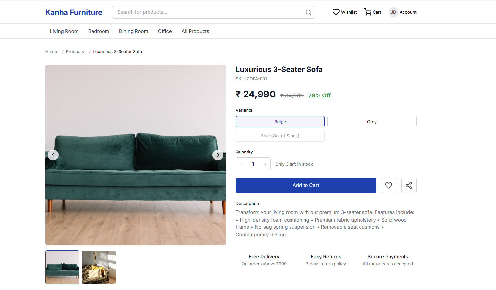

# 🛒 Kanha Ecommerce - Full Stack React & Laravel Application

A modern, full-featured ecommerce platform built with React (TypeScript) frontend and Laravel PHP backend, featuring real-time cart management, product catalog, and MySQL database persistence.


## 🌟 Features

### ✅ **Completed Features**
- **Product Catalog**: Browse products with categories, images, and pricing
- **Shopping Cart**: Add/remove items with real-time updates
- **Database Persistence**: All data stored in MySQL database
- **Responsive Design**: Mobile-first approach with Tailwind CSS
- **API Integration**: RESTful API communication between frontend and backend
- **Session Management**: Cart persistence across browser sessions
- **Product Search & Filtering**: Find products by category and search terms
- **Featured Products**: Showcase highlighted products
- **Image Management**: Product images with primary/secondary support
- **Backend Integration**: Laravel PHP backend with MySQL database
- **Development Environment**: Dual server setup (Laravel + Vite)

### 🐛 **Known Issues & Minor Bugs**
- **Cart Page Loading**: Requires both Laravel and Vite servers running
- **UI Polish**: Some minor styling inconsistencies
- **Error Handling**: Need better error messages for API failures
- **Loading States**: Missing loading indicators on some pages
- **Mobile Optimization**: Minor responsive design tweaks needed

### 🚧 **In Development**
- User Authentication & Registration
- Order Management System
- Payment Gateway Integration
- Admin Dashboard
- Email Notifications
- PDF Invoice Generation
- Frontend Bug Fixes & UI Polish

## 🏗️ **Architecture**

### **Frontend (React + TypeScript)**
- **Framework**: React 18 with TypeScript
- **Styling**: Tailwind CSS
- **Routing**: React Router DOM
- **State Management**: React Context API
- **HTTP Client**: Axios
- **Build Tool**: Vite

### **Backend (Laravel PHP)**
- **Framework**: Laravel 12.20.0
- **Database**: MySQL
- **Authentication**: Laravel Sanctum (planned)
- **API**: RESTful JSON API
- **ORM**: Eloquent

## 📁 **Project Structure**

```
ecommerceKanha/
├── frontend/                 # Laravel Backend
│   ├── app/
│   │   ├── Http/Controllers/ # API Controllers
│   │   └── Models/          # Eloquent Models
│   ├── database/
│   │   ├── migrations/      # Database Migrations
│   │   └── seeders/         # Database Seeders
│   ├── resources/js/        # React Frontend Code
│   │   ├── components/      # React Components
│   │   ├── pages/          # Page Components
│   │   ├── services/       # API Services
│   │   ├── contexts/       # React Contexts
│   │   └── utils/          # Utility Functions
│   ├── routes/             # Laravel Routes
│   └── public/             # Public Assets
├── docs/                   # Documentation
└── README.md              # This file
```

## 🚀 **Quick Start**

### **Prerequisites**
- Node.js 18+
- PHP 8.2+
- Composer
- MySQL 8.0+
- XAMPP (for local development)

### **Installation**

1. **Clone the repository**
   ```bash
   git clone https://github.com/yourusername/ecommerceKanha.git
   cd ecommerceKanha
   ```

2. **Backend Setup**
   ```bash
   cd frontend
   composer install
   cp .env.mysql .env
   php artisan key:generate
   php artisan migrate
   php artisan db:seed --class=EcommerceDataSeeder
   ```

3. **Frontend Setup**
   ```bash
   npm install
   npm run build
   ```

4. **Start Development Servers**
   ```bash
   # Terminal 1 - Laravel Backend
   php artisan serve --port=8000
   
   # Terminal 2 - React Frontend (if developing)
   npm run dev
   ```

5. **Access the Application**
   - Frontend: `http://localhost:3000` (development) or `http://localhost:8000` (production)
   - Backend API: `http://localhost:8000/api`
   - Database: phpMyAdmin at `http://localhost/phpmyadmin`

## 🔧 **Configuration**

### **Environment Variables**
Create `.env` file in the `frontend` directory:
```env
APP_NAME="Kanha Ecommerce"
APP_ENV=local
APP_KEY=base64:your-app-key-here
APP_DEBUG=true
APP_URL=http://localhost:8000

DB_CONNECTION=mysql
DB_HOST=127.0.0.1
DB_PORT=3306
DB_DATABASE=kanha_ecommerce
DB_USERNAME=root
DB_PASSWORD=

SESSION_DRIVER=database
SESSION_LIFETIME=120
```

### **API Endpoints**

#### **Products**
- `GET /api/db/products` - Get all products
- `GET /api/db/products/featured` - Get featured products
- `GET /api/db/products/{id}` - Get single product
- `GET /api/db/categories` - Get all categories

#### **Cart**
- `GET /api/db/cart` - Get cart contents
- `POST /api/db/cart/items` - Add item to cart
- `PUT /api/db/cart/items/{id}` - Update cart item
- `DELETE /api/db/cart/items/{id}` - Remove cart item

#### **System**
- `GET /api/db/health` - API health check

## 📱 **Screenshots**

### **Homepage**

*Modern homepage with featured products and categories*

### **Product Catalog**

*Product listing with search and filtering capabilities*

### **Shopping Cart**

*Real-time cart management with quantity updates*

### **Product Details**

*Detailed product view with images and specifications*

## 🗄️ **Database Schema**

### **Main Tables**
- **categories**: Product categories
- **products**: Product catalog with pricing and inventory
- **product_images**: Product image management
- **cart**: Shopping cart sessions
- **cart_items**: Individual cart items
- **users**: User accounts (planned)

## 🚀 **Deployment**

### **Frontend (Vercel)**
1. Connect GitHub repository to Vercel
2. Set build command: `npm run build`
3. Set output directory: `frontend/public`
4. Deploy automatically on push

### **Backend (Planned)**
- Laravel backend deployment guide coming soon
- Database migration scripts included
- Environment configuration templates provided

## 🛠️ **Development**

### **Available Scripts**
```bash
# Frontend Development
npm run dev          # Start Vite dev server
npm run build        # Build for production
npm run preview      # Preview production build

# Backend Development
php artisan serve    # Start Laravel server
php artisan migrate  # Run database migrations
php artisan db:seed  # Seed database with sample data
```

### **Code Style**
- **Frontend**: ESLint + Prettier
- **Backend**: PSR-12 PHP Standards
- **Database**: Laravel naming conventions

## 🤝 **Contributing**

1. Fork the repository
2. Create a feature branch (`git checkout -b feature/amazing-feature`)
3. Commit your changes (`git commit -m 'Add amazing feature'`)
4. Push to the branch (`git push origin feature/amazing-feature`)
5. Open a Pull Request

## 📝 **License**

This project is licensed under the MIT License - see the [LICENSE](LICENSE) file for details.

## 👨‍💻 **Author**

**Himanshu** - *Full Stack Developer*
- GitHub: [@yourusername](https://github.com/yourusername)
- LinkedIn: [Your LinkedIn](https://linkedin.com/in/yourprofile)

## 🙏 **Acknowledgments**

- React Team for the amazing frontend framework
- Laravel Team for the robust backend framework
- Tailwind CSS for the utility-first CSS framework
- All open source contributors

## 📊 **Project Status**

- ✅ **Core Features**: Product catalog, cart management, database persistence
- 🚧 **In Progress**: User authentication, order management
- 📋 **Planned**: Payment integration, admin dashboard, email notifications

---

**Built with ❤️ using React, Laravel, and MySQL**
